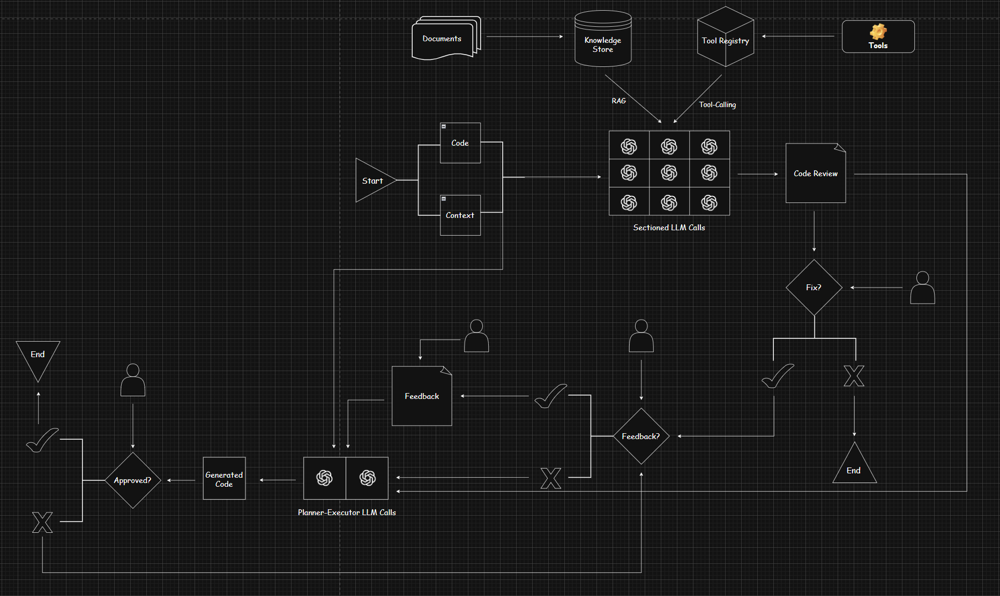

  

  <b>Coding Agent</b>
----------------------
a coding agent for code review

  

## About

In this work, we present an experimental framework that enhances the code review process via augmenting the core developer workflow. Our coding agent is built on the belief that the future reveals itself not in systems that act independently, but in architectures that breathe alongside us, enhancing the uniquely human capacity for creative insight. 

To this end, our agent is composed of a thoughtfully crafted workflow with augmented LLM blocks and deliberate human checkpoints to streamline the code review process. To evaluate our agent, we compare our approach with direct foundation model use.

This work hopes to serve as a thoughtful comma in an ongoing dialogue about what we build, why we build it, and who we become alongside our creations. 

## Workflow

The workflow of the agent is represented by the diagram below:

  

At a high-level, the agent takes in as input some code with its corresponding context and spits out as output a comprehensive code review.  Furthermore, if the user opts for it, the agent generates improved code based on the previously generated code review and optional human feedback. 

Let's dive deeper into the technical elements that compose the agent.

## Notes

## References

## Meta

Aritra Ghosh – aritraghosh543@gmail.com

Distributed under the MIT license. See `LICENSE` for more information.

[https://github.com/arighosh05/](https://github.com/arighosh05/)

## Contributing

1. Fork it (<https://github.com/arighosh05/coding-agent/fork>)
2. Create your feature branch (`git checkout -b feature/fooBar`)
3. Commit your changes (`git commit -am 'Add some fooBar'`)
4. Push to the branch (`git push origin feature/fooBar`)
5. Create a new Pull Request
