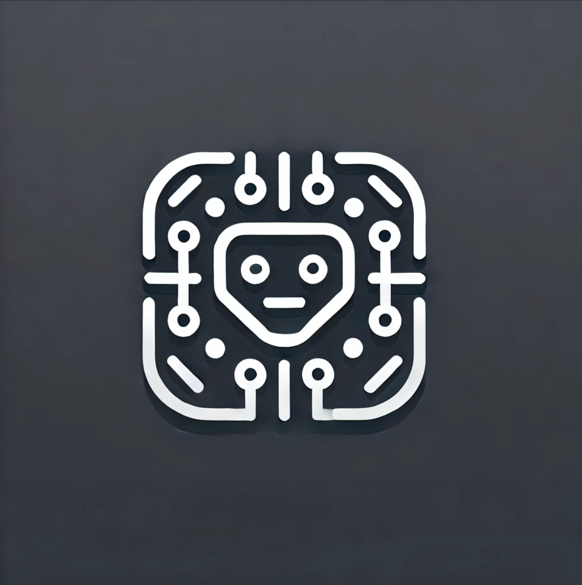

  

  <b>Coding Agent</b>
----------------------
a coding agent for code review

  

## About

In this work, we present an experimental framework that enhances the code review process via augmenting the core developer workflow. Our coding agent is built on the belief that the future reveals itself not in systems that act independently, but in architectures that breathe alongside us, enhancing the uniquely human capacity for creative insight. 

To this end, our agent is composed of a thoughtfully crafted workflow with augmented LLM blocks and deliberate human checkpoints to streamline the code review process. To evaluate our agent, we compare our approach with direct foundation model use, exploring the nuances of orchestrated AI assistance versus monolithic system deployment.

This work hopes to serve as a thoughtful comma in an ongoing dialogue about what we build, why we build it, and who we become alongside our creations. 

## Workflow

The workflow of the agent is represented by the diagram below:

  

At a high-level, the agent takes in as input the code and the corresponding context for the code review. Documents are ingested into a knowledge base and tools are added to a tool registry in order to augment the vanilla LLM blocks. For each aspect, the agent leverages both a knowledge-based retrieval of context and specialized static analysis tools to generate detailed insights via parallelized calls to augmented LLM blocks. These individual analyses are then aggregated and presented as a comprehensive code review report. If the user opts for improvements, a separate code generation agent comes into play. This agent first generates a detailed improvement plan by prioritizing issues and incorporating any human feedback, and then synthesizes an updated version of the code using a dual LLM approach that alternates between planning and execution. 

## Notes

## References

## Meta

Aritra Ghosh – aritraghosh543@gmail.com

Distributed under the MIT license. See `LICENSE` for more information.

[https://github.com/arighosh05/](https://github.com/arighosh05/)

## Contributing

1. Fork it (<https://github.com/arighosh05/coding-agent/fork>)
2. Create your feature branch (`git checkout -b feature/fooBar`)
3. Commit your changes (`git commit -am 'Add some fooBar'`)
4. Push to the branch (`git push origin feature/fooBar`)
5. Create a new Pull Request
